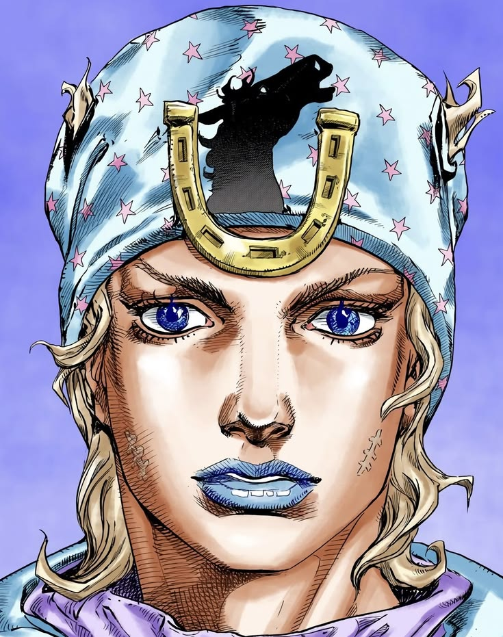
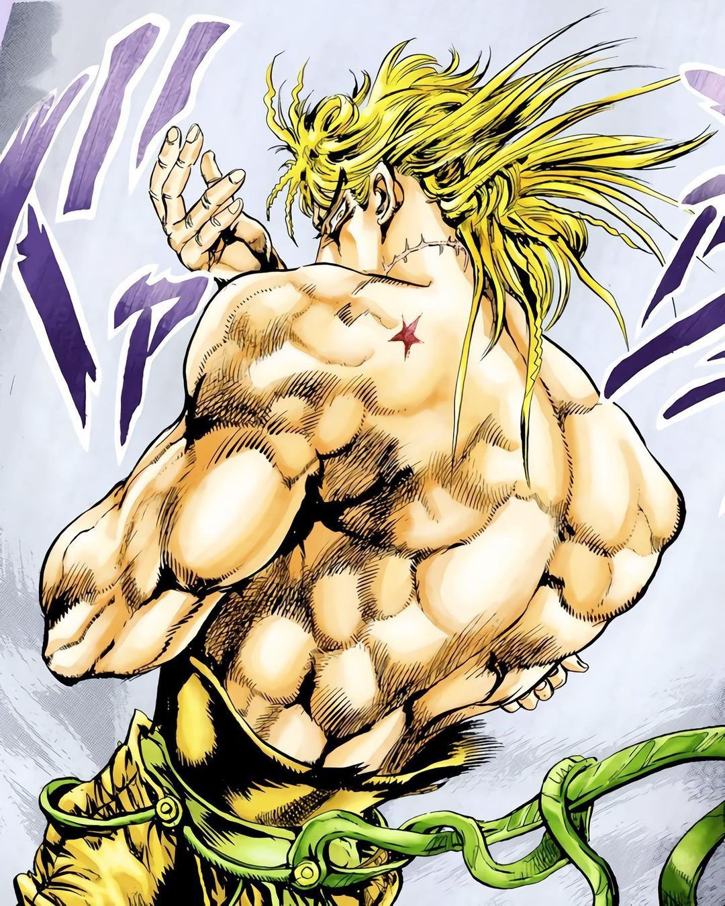
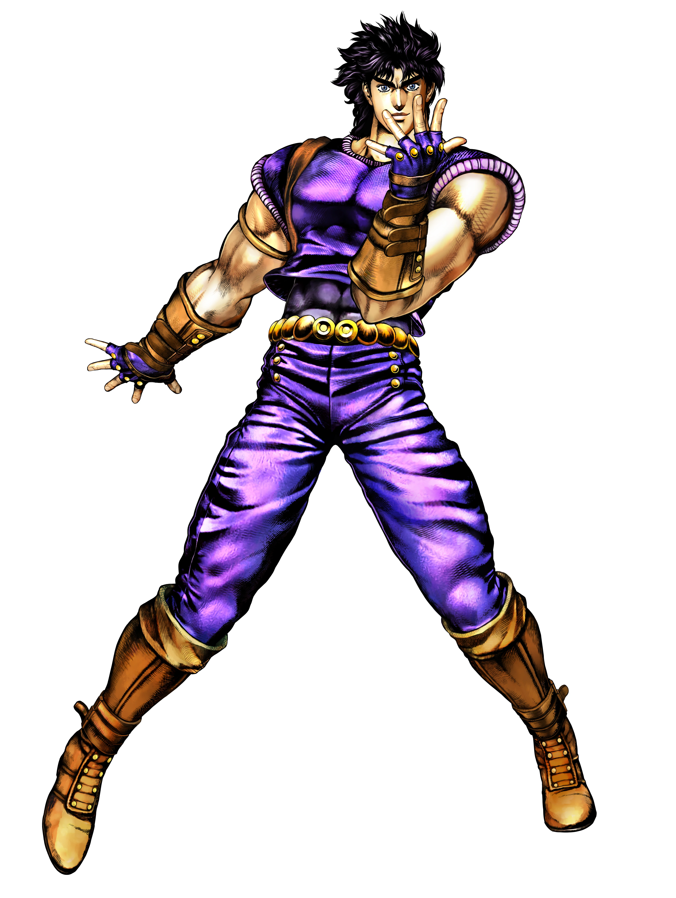
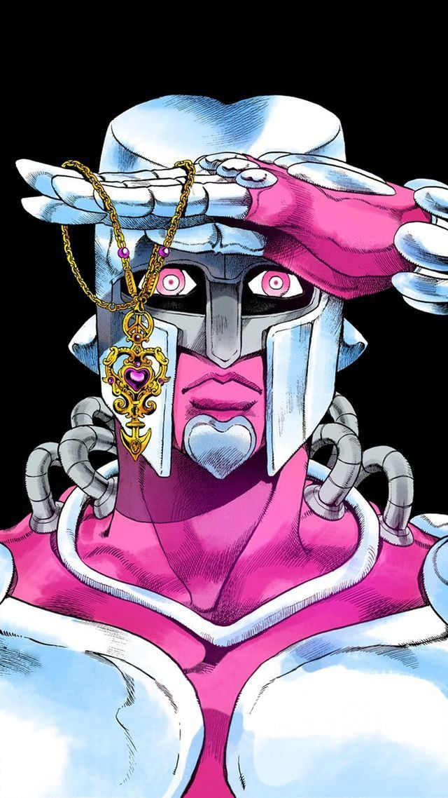
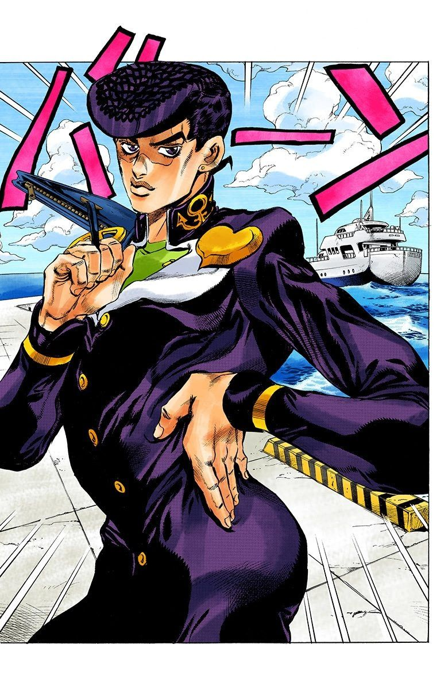
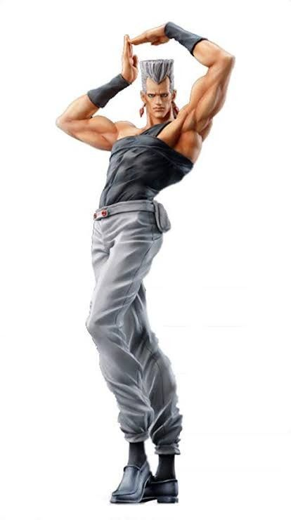
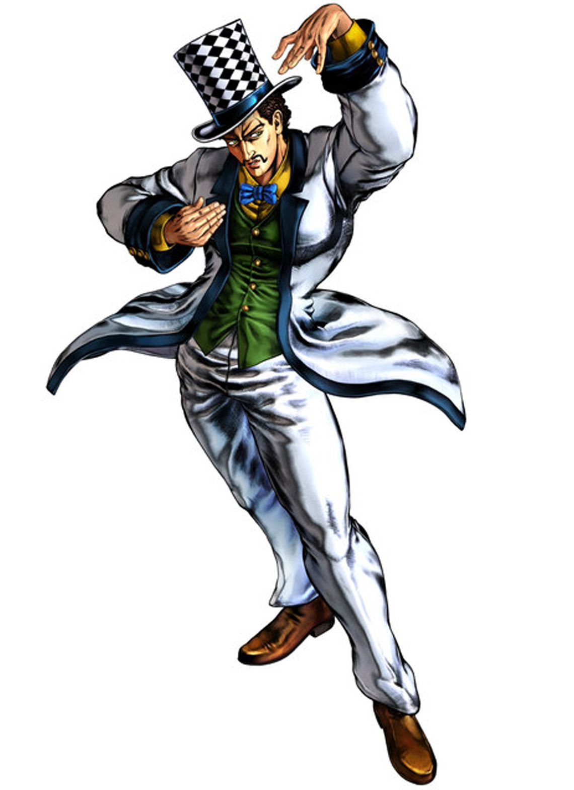
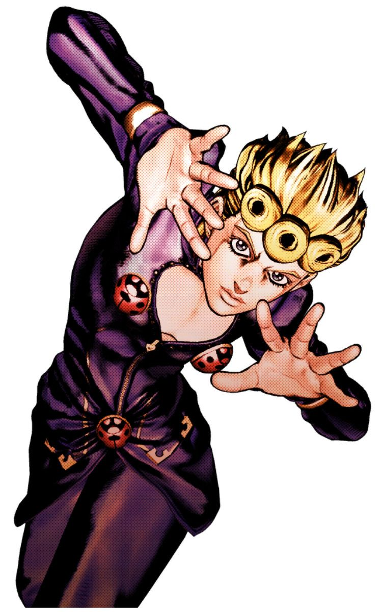
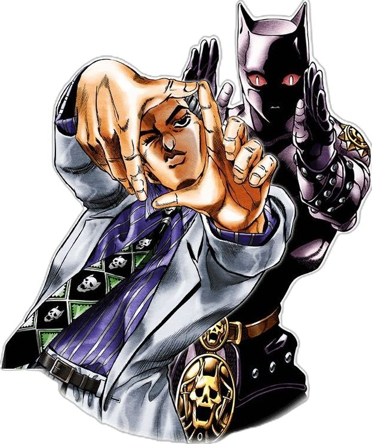

# Jojo poses

## tarea-02

- **Integrante-1**
- **Integrante-2**

- Asignatura: Dispositivos Periféricos y Plataformas para la Interacción Digital **DIS9087**

Proyecto de reconocimiento de gestos, utilizando Python y MediaPipe. Realizado tomando como referencia este repositorio:

- <https://github.com/catherpiee/meowmeowcatcam>

## Generar cambios

Ya que es dificil poder navegar en código que es desconocido y sin tener experiencia, generé la _etiqueta_ "_facu ojo_". Para que al buscarla con _ctrl + F_ saber que partes se pueden modificar para añadir nuevas poses

### Python / gesture_memes.py

1. La primera sección que se debe editar es GESTURE_MEMES

```py

# --- Diccionario actualizado ---
# facu ojo
GESTURE_MEMES = {
    "default": ["default.jpg"],
    "spinCat": ["spin cat.mov"],
    "kiraPose": ["kira.jpg"],
    "josukePose": ["josuke.jpg"],
    "giornoPose": ["giorno.jpg"],
    "zeppeliPose": ["zeppeli.jpg"],
    "polnareffPose": ["polnareff.jpg"], 
    "jonathanPose": ["jonathan.webp"],  
    "crazyDiamondPose":["crazydiamond.jpg"], 
}


```

se puede apreciar el formato para añadir nuevas poses, es importante que tanto como la función (lado izquierda) y el nombre del archivo referenciado (lado derecho) corresponden a lo largo del código y los archivos

2. Más abajo podemos encontrar ya el código que referencia a las poses, primero encontraremos las de **2 manos**

```py


        # INICIO DE GESTOS A 2 MANOS
        if len(hands) == 2:
            avg_scale = (hands[0]["handScale"] + hands[1]["handScale"]) / 2

            # facu ojo      

            # --- POSE DE POLNAREFF ---
            ambas_abiertas = hands[0]["curledCount"] <= 1 and hands[1]["curledCount"] <= 1
            distancia_palmas = dist(hands[0]["palmCenter"], hands[1]["palmCenter"]) / avg_scale
            manos_juntas = distancia_palmas < 1.8 

            def es_horizontal(h):
                return abs(h["indexTip"][0] - h["wrist"][0]) > abs(h["indexTip"][1] - h["wrist"][1])
            def es_vertical(h):
                return abs(h["indexTip"][1] - h["wrist"][1]) > abs(h["indexTip"][0] - h["wrist"][0])

            orientacion_cruzada = (es_horizontal(hands[0]) and es_vertical(hands[1])) or \
                                  (es_vertical(hands[0]) and es_horizontal(hands[1]))

            arriba_de_la_cabeza = True
            if face_is_fresh:
                mouth_center, face_width, _, _, _ = self.last_face
                head_top_y = mouth_center[1] - face_width * 0.8
                arriba_de_la_cabeza = hands[0]["palmCenter"][1] < head_top_y and hands[1]["palmCenter"][1] < head_top_y

            if ambas_abiertas and manos_juntas and orientacion_cruzada and arriba_de_la_cabeza:
                return "polnareffPose"

```
Se entiende que luego de _# facu ojo_ debe ir una nueva pose de **2 manos**

3. En caso de que la pose corresponde a una sola mano, se debe bajar un poco más

```py

  # AQUi COMIENZAN LOS GESTOS DE UNA SOLA MANO
        # ==========================================
        
        h = hands[0]

        # --- NUEVA LoGICA: POSE DE JONATHAN (Una mano frente al rostro) ---
        # 1. La mano debe estar completamente abierta (0 dedos recogidos)
        mano_abierta = h["curledCount"] == 0
        
        # 2. Orientacion vertical (la muneca debe estar mas abajo que la palma)
        # Recordatorio: En pantalla, el eje Y aumenta hacia abajo.
        es_vertical = h["wrist"][1] > h["palmCenter"][1]

        # 3. Posicion cubriendo o frente al rostro
        frente_al_rostro = False
        if face_is_fresh:
            mouth_center, face_width, _, _, _ = self.last_face
            # Distancia normalizada entre la palma y el centro de la boca
            d_rostro = dist(h["palmCenter"], mouth_center) / face_width
            # Exigimos proximidad estricta al rostro
            frente_al_rostro = d_rostro < 0.7 

        if mano_abierta and es_vertical and frente_al_rostro:
            return "jonathanPose"   

```

<br>

### JavaScript / app.js

1. Al igual que Python, lo primero es colocar el nombre de las funciones y su respectivo archivo

```py

// gestos
// facu ojo
const GESTURE_MEMES = {
  default: ["poses/default.jpg"],
  kiraPose: ["poses/kira.jpg"], 
  josukePose: ["poses/josuke.jpg"],
  giornoPose: ["poses/giorno.jpg"],
  zeppeliPose: ["poses/zeppeli.jpg"],
  polnareffPose: ["poses/polnareff.jpg"],
  jonathanPose: ["poses/jonathan.webp"],
  sideEyeDio: ["poses/dio.jpg"], // <-- AÑADIDO: Evita error si giras la cabeza y no hay manos
  crazyDiamondPose: ["poses/crazydiamond.jpg"],

};


```

2. Para añadir una pose de 2 manos

```py

// ojo facu
      // agregar poses de 2 manos

      // Pose de Polnareff
      if (h0.curledCount <= 1 && h1.curledCount <= 1) {
        const headTopY = mouthCenter.y - (faceWidth * 1.1);
        
        if (h0.palmCenter.y < headTopY && h1.palmCenter.y < headTopY) {
          const palmDist = dist(h0.palmCenter, h1.palmCenter) / faceWidth;
          
          const dir0 = vec(h0.wrist, h0.palmCenter);
          const dir1 = vec(h1.wrist, h1.palmCenter);
          
          const angle = angleDeg(dir0, dir1);

          if (palmDist < 1.5 && angle > 50 && angle < 130) {
            return "polnareffPose";
          }
        }
      }

```

3. Para poses de una mano

```py

// Extraemos la primera mano para evaluar gestos de una sola mano
  const h = hands[0];

  // 1. PRIMERO evaluamos Crazy Diamond (porque sus reglas son más estrictas)
  if (h.curledCount === 0 && faceIsFresh) {
    const { mouthCenter, faceWidth } = lastFace;

    const d = dist(h.palmCenter, mouthCenter) / faceWidth;
    const isAboveMouth = h.palmCenter.y < mouthCenter.y;

    const deltaX = Math.abs(h.palmCenter.x - h.wrist.x);
    const deltaY = Math.abs(h.palmCenter.y - h.wrist.y);
    const isHorizontal = deltaX > (deltaY * 1.5);

    if (d < 1.5 && isAboveMouth && isHorizontal) {
      return "crazyDiamondPose";
    }
  }

```

## Gestos

| # | *Nombre* | *Cómo se activa* | *imagen* |
| - | -------- | ---------------- | -------- |
| 1 | default | Mirar de frente a la cámara |  |
| 2 | sideEyeDio | Mover el rostro de manera leve hacía el lado derecho o izquierdo |  |
| 3 | jonathanPose | Colocar la mano derecha con los 5 dedos abiertos frente al rostro y por debajo de los ojos |  |
| 4 | crazyDiamondPose | La mano derecha debe estar con los 5 dedos extendidos y juntos frente al rostro, **sobre la altura de los ojos** |  |
| 5 | josukePose | Posicionar el puño izquierdo cerrado mirando de frente a la cámara, a la altura de los hombros. Además, la mano derecha debe estar apoyada en la espalda, mientras esta se encorva de manera concava |  |
| 6 | polnareffPose | Se debe colocar la mano izquierda con los 5 dedos estirada sobre la cabeza y apuntando hacia arriba. En cambio, en el lado derecho debemos tener la mano estirada, pero apuntando de manera perpendicular a la mano izquierda |  |
| 7 | zeppeliPose | Para esta pose, debemos tener la mano derecha a la altura de los ojos, con los 5 dedeos extendidos. Para la mano izquierda, esta debe estar extendida y apuntado hacia arriba, siempre y cuando este ubicada frente al pecho |  |
| 8 | giornoPose | Ambas manos deben estar abiertas, con los dedos separados y con las palmas mirando a la cámara. Es importante que la mano derecha esté por debajo de la izquierda y ambas deben situarse a la altura del rostro |  |
| 9 | kiraPose | Se debe formar una _pistola_ con ambas manos, donde la izquierda debe apuntar al piso y la derecha arriba. Ambas deben posicionarse juntas, de tal manera que se visualice un rectángulo con ambas manos, este debe posicionarse frente al rostro |  |

<br>

## Documentación

Para realizar esta aplicación se dispuse de ayuda de herramientas de Inteligencia Artificial, específicamente de Gemini.

Se inicio un chat central, en el que se adjuntó el link del [repositorio original](https://github.com/catherpiee/meowmeowcatcam), luego mediante el uso de las _ramas_ que ofrece este tipo de IA se secciono el trabajo en

- [py • Crear nueva pose de manos [Original]](https://share.gemini.google/a2cI90H061M1): 1er chat en el que se buscó generar un código inicial para entender cómo lograr añadir poses nuevas, específicamente en Python
- [js • Crear nueva pose de manos](https://share.gemini.google/4vg7V0smEcSk) Esta rama nació del chat anterior **_[py • Crear nueva pose de manos [Original]]**_ y se enfocó en entender el código JavaScript y añadir la misma pose que se mencionó en el chat mencionado
- [code • py • Crear nueva pose de manos](https://share.gemini.google/QBlOT0G0QJGk): En este hilo nacido del 1er chat se estandarizó la generación de código Python para sumar nuevas poses. Se adjuntó imagen de referencia y parámetros a considerar, ya sean la cantidad de manos y que formato debía tener el código de salida
- [code • js • Crear nueva pose de manos](https://share.gemini.google/284l5InBAr2U) Esta rama nació de _**[js • Crear nueva pose de manos]**_, buscando lo mismo que la mencionada anteriormente, la única diferencia es que el código de salida era JavaScript
- [fix • code • py • Crear nueva pose de manos](https://share.gemini.google/S1SqU7R42Xr9) Luego de una depuración de parte del contenido original, se buscó optimizar ciertos elementos y esto generó errores en el código. Para aprovechar se ramificó el chat **_[code • py • Crear nueva pose de manos]_** y se buscó la solución a los errores, sumado a entender ciertos aspectos
- [fix • code • js • Crear nueva pose de manos](https://share.gemini.google/ylxoNNKcURUu) Lo mismo que la rama anterior, solo que enfocada en JavaScript

  
- [video](./)
